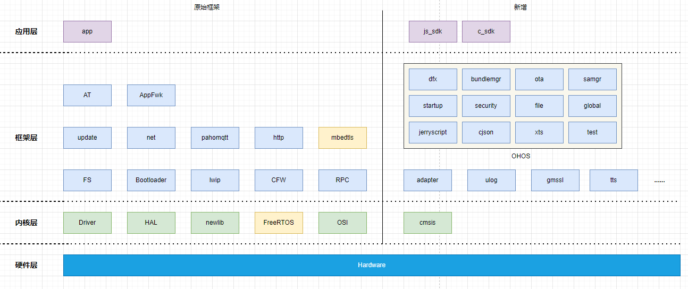

# 一种OpenHarmony L0系统适配方案

## 1. 简介

本文将介绍在不改变原有系统基础框架的基础上，一种OpenHarmony L0系统适配方案。本文档使用OpenHarmony release 3.2版本。

## 2. 方案设计

本文使用的硬件模块的主要特性及功能如下：

| 参数     | 说明                                                         |
| -------- | ------------------------------------------------------------ |
| CPU      | Cortex-A5 最高频率500MHz                                     |
| 存储     | pSRAM 128Mb + SPI NOR Flash 64Mb                             |
| OS       | RTOS                                                         |
| 编译系统 | CMake                                                        |
| 功能模块 | bootloader、at、ota、net、audio、fs、mbedtls、rpc、tts、unity等 |

按照OpenHarmony的官方适配指导，适配工作需要将内核由RTOS改为Liteos-m，并移植原生所有功能模块和镜像打包功能。如果采用该方案，将面临诸多困难：编译系统需要重写为gn+ninja、原始底层库和功能全面移植，这样一来打乱了原始的编译习惯，编译脚本需要重新编写，需要适配新的OS接口、已经完成的功能需要重新调试测试。过多的改动，意味着无法聚焦项目的主要功能点，这种方案工作量大，难度大，工期无法保障。

OpenHarmony的L0系统编译过程是，首先将各模块编译为静态库，再链接为应用程序，最后打包烧录入硬件。系统运行时，只有单一进程，各个不同的任务以多个线程运行。结合原生代码和OpenHarmony的特点，最终采用的适配方案如下：

- 使用原生代码的交叉编译工具链编译OpenHarmony为静态库，将静态库集成到原生代码中；

- OpenHarmony中不编译liteos-m内核，使用原生代码的RTOS内核；

- 不改变原生代码的编译系统和打包系统；
- 原生代码中新增适配代码，以提供OpenHarmony需要的接口。

该方案在最小改动原系统的前提下，完成OpenHarmony的适配。

整体软件框架的设计如下：



方案保持了原始框架的大部分功能不改变，新增OpenHarmony的模块功能和其他项目需求功能，修改或升级部分原生功能（FreeRTOS、mbedtls等）。

## 3. OpenHarmony编译

### 3.1 创建虚拟设备编译

新建配置vendor/ohemu/L0_xts_demo和device/qemu/L0_xts_demo。

vendor/ohemu/L0_xts_demo/目录结构如下：

```shell
vendor/ohemu/L0_xts_demo/
├── BUILD.gn
├── config.json
├── hals
│   └── utils
├── kernel_configs
│   ├── debug.config
│   ├── debug.rar
│   ├── no_kernel_test.config
│   └── release.config
├── LICENSE
├── ohos.build
└── qemu_run.sh
```

device/qemu/L0_xts_demo/目录结构如下：

```shell
device/qemu/L0_xts_demo/
├── BUILD.gn
├── driver
│   └── hals
├── liteos_m
│   ├── board
│   ├── BUILD.gn
│   └── config.gni
├── ohos.build
├── README.md
└── README_zh.md
```


### 3.2 子系统配置

vendor/ohemu/L0_xts_demo/config.json文件包含了所有必须的子系统配置，如下：

```json
{
  "product_name": "L0_xts_demo",
  "ohos_version": "OpenHarmony 1.0",
  "type":"mini",
  "version": "3.0",
  "device_company": "qemu",
  "board": "L0_xts_demo",
  "kernel_type": "liteos_m",
  "kernel_version": "3.0.0",
  "subsystems": [
    {
      "subsystem": "hiviewdfx",
      "components": [
        { "component": "hievent_lite", "features":[] },
        { "component": "hiview_lite", "features":[] },
        { "component": "hilog_lite", "features":[] }
      ]
    },
    {
      "subsystem": "bundlemanager",
      "components": [
        { "component": "bundle_framework_lite", "features":[] }
      ]
    },
    {
      "subsystem": "updater",
      "components": [
        { "component": "ota_lite", "features":[] }
      ]
    },
    {
      "subsystem": "global",
      "components": [
        { "component": "resource_management_lite", "features":[] }
      ]
    },
    {
      "subsystem": "systemabilitymgr",
      "components": [
        { "component": "samgr_lite", "features":[] }
      ]
    },
    {
      "subsystem": "startup",
      "components": [
        { "component": "bootstrap_lite", "features":[] },
        {
          "component": "init_lite",
          "features": [
            "enable_ohos_startup_init_feature_begetctl_liteos = true"
          ]
        },
        { "component": "syspara_lite", "features": [] }
      ]
    },
    {
      "subsystem": "security",
      "components": [
        { "component": "huks", "features":
          [
            "huks_use_lite_storage = true",
            "huks_use_hardware_root_key = true",
            "huks_config_file = \"hks_config_lite.h\""
          ]
        }
      ]
    },
    {
      "subsystem": "xts",
      "components": [
        { "component": "xts_acts", "features": [] },
        { "component": "xts_tools", "features": [] }
      ]
    },
    {
      "subsystem": "thirdparty",
      "components": [
        { "component": "bounds_checking_function", "features": [] },
        { "component": "thirdparty_jerryscript", "features": [] },
        { "component": "cjson", "features": [] }
      ]
    },
    {
      "subsystem": "commonlibrary",
      "components": [
        { "component": "file", "features": [] }
      ]
    }
  ],
  "third_party_dir": "",
  "product_adapter_dir": "//vendor/ohemu/L0_xts_demo/hals"
}
```

### 3.3 工具链配置

device/qemu/L0_xts_demo/liteos_m/config.gni包含了板级编译配置，根据原生编译系统的编译设置来修改，尽量保持一致，如下：

```properties
# Kernel type, e.g. "linux", "liteos_a", "liteos_m".
kernel_type = "liteos_m"

# Kernel version.
kernel_version = "3.0.0"

# Board CPU type, e.g. "cortex-a7", "riscv32".
board_cpu = "cortex-a5"

# Board arch, e.g.  "armv7-a", "rv32imac".
board_arch = ""

# Toolchain name used for system compiling.
# E.g. gcc-arm-none-eabi, arm-linux-harmonyeabi-gcc, ohos-clang,  riscv32-unknown-elf.
# Note: The default toolchain is "ohos-clang". It's not mandatory if you use the default toolchain.
board_toolchain = "arm-none-eabi-gcc"

use_board_toolchain = true

# The toolchain path installed, it's not mandatory if you have added toolchain path to your ~/.bashrc.
board_toolchain_path = ""

# Compiler prefix.
board_toolchain_prefix = "arm-none-eabi-"

# Compiler type, "gcc" or "clang".
board_toolchain_type = "gcc"

#Debug compiler optimization level options
board_opt_flags = [
  "-mcpu=cortex-a5",
  "-mtune=generic-armv7-a",
  "-mthumb",
  "-mfpu=neon-vfpv4",
  "-mfloat-abi=hard",
  "-mno-unaligned-access",
]

# Board related common compile flags.
board_cflags = [
  "-Wall",
  "-fdata-sections",
  "-ffunction-sections",
  "-fno-builtin",
  "-fno-strict-aliasing",
  "-fsigned-char",
  "-g",
  "-Os",
  "-DUSE_HAL_DRIVER",
  "-D__LITEOS_M__",
  "-DLOSCFG_BASE_CORE_HILOG",
]
board_cflags += board_opt_flags

board_asmflags = [
  "-Og",
  "-Wall",
  "-fdata-sections",
  "-ffunction-sections",
]
board_asmflags += board_opt_flags

board_cxx_flags = board_cflags

board_ld_flags = []

# Newlib adapt.
board_ld_flags += [
  "-Wl,--wrap=_free_r",
  "-Wl,--wrap,_malloc_usable_size_r",
  "-Wl,--wrap,_malloc_r",
  "-Wl,--wrap,_memalign_r",
  "-Wl,--wrap,_realloc_r",
  "-Wl,--wrap,_calloc_r",
]

# Board related headfiles search path.
board_include_dirs = [ "//utils/native/lite/include" ]

# Board adapter dir for ohos components.
board_adapter_dir = "//device/qemu/L0_xts_demo/driver"

# Sysroot path.
board_configed_sysroot = ""

# Board storage type, it used for file system generation.
storage_type = "spinor"
```

### 3.4 编译命令

```shell
python3 ./build.py -p L0_xts_demo -f -b debug --gn-args build_xts=true
```

编译出的静态库位于**out/L0_xts_demo/L0_xts_demo/libs**

### 3.5 优化剪裁

由于是L0系统，没有必要下载完整OpenHarmony源码包，所以对manifest和prebuild进行剪裁，只下载必须的软件和源码。

修改**build/prebuilts_download_config.json**，只保留gn、ninja和python。

修改**.repo/manifests/ohos/ohos.xml**，删除不需要的包，剪裁后仅剩50个包。

### 3.6 集成

将编译后的静态库拷贝到原生编译系统中，并编写demo程序，进行编译。

#### 3.6.1 编写demo

OpenHarmony的demo分为两个单元，main.c和demo.c。

- main.c负责启动OpenHarmony，
- demo.c为应用程序，循环打印hilog日志。

main.c主要代码如下：

```c
//main.c
extern void OHOS_SystemInit();
static bool ohos_started = false;
static void ohos_start()
{
    if (ohos_started) {
        return;
    }
    ohos_started = true;
    OHOS_SystemInit();
}

#define CREATE_FILE(n)                 \
    do {                               \
        int fd = vfs_open(n, O_CREAT); \
        vfs_close(fd);                 \
    } while (0)

int appimg_enter(void* param)
{
    vfs_mkdir("/data", 0);
    vfs_mkdir("/dev", 0);
    vfs_mkdir("/data/storage", 0);
    CREATE_FILE("/data/storage/hks_keystore");
    CREATE_FILE("/data/persist_parameters");
    CREATE_FILE("/data/tmp_persist_parameters");
    ohos_start();
    return 0;
}

void appimg_exit(void)
{
}
```

demo.c主要代码如下：

```c
static void DemoSdkTask(void* arg)
{
    (void)arg;
    HILOG_INFO(HILOG_MODULE_APP, "DemoSdkTask start , arg:%p", arg);
    for (int n = 0; n < 1000; n++) {
        HILOG_INFO(HILOG_MODULE_APP, "DemoSdkTask hello OpenHarmony ++++++++++ %d", n);
        osiThreadSleep(5000);
    }
    HILOG_INFO(HILOG_MODULE_APP, "DemoSdkTask end");
}

void DemoSdkMain(void)
{
    osThreadAttr_t attr = {0};
    attr.stack_size     = 1024;
    attr.priority       = osPriorityNormal;
    attr.name           = "DemoSdk";
    if (osThreadNew((osThreadFunc_t)DemoSdkTask, NULL, &attr) == NULL) {
        HILOG_ERROR(HILOG_MODULE_APP, "Failed to create DemoSdkTask\r\n");
    }
}

APP_FEATURE_INIT(DemoSdkMain);
```

#### 3.6.2 编译demo

创建CMakeFile.txt文件。

定义OpenHarmony的头文件包含目录及库文件：

```cmake
set(OpenHarmony_INCLUDE_PATHS 
    base/hiviewdfx/hilog_lite/interfaces/native/kits/hilog_lite 
    commonlibrary/utils_lite/include 
    base/hiviewdfx/hilog_lite/command 
    base/hiviewdfx/hilog_lite/frameworks/mini 
    kernel/liteos_m/kernel/include 
    kernel/liteos_m/utils 
    base/startup/bootstrap_lite/services/source 
    foundation/systemabilitymgr/samgr_lite/interfaces/kits/samgr 
    foundation/bundlemanager/bundle_framework_lite/interfaces/kits/bundle_lite 
    foundation/bundlemanager/bundle_framework_lite/utils/bundle_lite 
    third_party/bounds_checking_function/include 
    foundation/ability/ability_lite/interfaces/kits/want_lite
    commonlibrary/utils_lite/include
)

set(OpenHarmony_LIBS "${OpenHarmony_lib_path}/libbegetutil.a \
${OpenHarmony_lib_path}/libbootstrap.a \
${OpenHarmony_lib_path}/libhal_file_static.a \
${OpenHarmony_lib_path}/libhal_sysparam.a \
${OpenHarmony_lib_path}/libhievent_lite_static.a \
${OpenHarmony_lib_path}/libhilog_lite_static.a \
${OpenHarmony_lib_path}/libhilog_static.a \
${OpenHarmony_lib_path}/libhiview_lite_static.a \
${OpenHarmony_lib_path}/libinit_log.a \
${OpenHarmony_lib_path}/libinit_utils.a \
${OpenHarmony_lib_path}/libnative_file.a \
${OpenHarmony_lib_path}/libparam_client_lite.a \
${OpenHarmony_lib_path}/libsamgr.a \
${OpenHarmony_lib_path}/libsamgr_adapter.a \
${OpenHarmony_lib_path}/libsamgr_source.a \
${OpenHarmony_lib_path}/libsec_static.a \
")
set(OpenHarmony_FLAGS "-Wl,--whole-archive ${OpenHarmony_LIBS} -Wl,--no-whole-archive")
```

编译demo程序：

```cmake
set(target OpenHarmony_demo)
add_appimg_flash_example(${target} OpenHarmony-main.c OpenHarmony-demo.c)
include_directories(${INC_DIR})
include_directories(${INC_DIR}/system)

target_compile_definitions(${target} PRIVATE OSI_LOG_TAG=LOG_TAG_OpenHarmony)

foreach(inc ${OpenHarmony_INCLUDE_PATHS})
    include_directories(${OpenHarmony_inc_path}/${inc})
endforeach()
set_target_properties(${target} PROPERTIES LINK_FLAGS "${OpenHarmony_FLAGS}")
```

编译后生成镜像文件OpenHarmony_demo.img

#### 3.6.3 编译xts

生成多个xts镜像：

```cmake
######################################XTS start###########################
set(OpenHarmony_LIBS_XTS "")
macro(add_target_OpenHarmony_xts)
    foreach(arg ${ARGN})
        set(OpenHarmony_XTS_LIBS "${OpenHarmony_lib_path}/libhctest.a \
            ${OpenHarmony_lib_path}/libmodule_${arg}.a \
            ")
        set(target OpenHarmony_xts_${arg})
        add_appimg_flash_example(${target} OpenHarmony-main.c)
        include_directories(${INC_DIR})
        target_compile_definitions(${target} PRIVATE OSI_LOG_TAG=LOG_TAG_OpenHarmony)
        set(OpenHarmony_FLAGS "-Wl,--whole-archive ${OpenHarmony_LIBS} ${OpenHarmony_LIBS_XTS} ${OpenHarmony_XTS_LIBS} -Wl,--no-whole-archive")
        set_target_properties(${target} PROPERTIES LINK_FLAGS "${OpenHarmony_FLAGS}")
    endforeach()
endmacro()

###########################################################################
#ActsBootstrapTest ActsDfxFuncTest ActsHieventLiteTest ActsUtilsFileTest
###########################################################################
add_target_OpenHarmony_xts(ActsBootstrapTest ActsDfxFuncTest ActsHieventLiteTest ActsUtilsFileTest)

###########################################################################
#ActsSamgrTest
###########################################################################
set(OpenHarmony_LIBS_XTS "${OpenHarmony_lib_path}/libbroadcast.a")
add_target_OpenHarmony_xts(ActsSamgrTest)

###########################################################################
#ActsParameterTest
###########################################################################
set(OpenHarmony_LIBS_XTS "${OpenHarmony_lib_path}/libinithook.a")
add_target_OpenHarmony_xts(ActsParameterTest)

###########################################################################
#ActsUpdaterFuncTest
###########################################################################
set(OpenHarmony_LIBS_XTS "${OpenHarmony_lib_path}/libhal_update_static.a \
    ${OpenHarmony_lib_path}/libhota.a \
    ")
add_target_OpenHarmony_xts(ActsUpdaterFuncTest)

###########################################################################
#ActsHuksHalFunctionTest
###########################################################################
set(OpenHarmony_LIBS_XTS "${OpenHarmony_lib_path}/libhuks_3.0_sdk.a \
    ${OpenHarmony_lib_path}/libhuks_test_common.a \
    ")
add_target_OpenHarmony_xts(ActsHuksHalFunctionTest)

###########################################################################
#ActsBundleMgrTest
###########################################################################
set(OpenHarmony_LIBS_XTS "${OpenHarmony_lib_path}/libbundle.a \
    ${OpenHarmony_lib_path}/libbundlems.a \
    ${OpenHarmony_lib_path}/libcjson_static.a \
    ${OpenHarmony_lib_path}/libwant.a \
    ${OpenHarmony_lib_path}/libace_lite.a \
    ${OpenHarmony_lib_path}/libglobal_resmgr.a \
    ")
add_target_OpenHarmony_xts(ActsBundleMgrTest)
```

#### 3.6.4 链接

修改ld文件，主要是修改text段，新增OpenHarmony的自定义段设置：

```c
    .text ALIGNMENT : {
        __text_start = .;
        *(DEF_RO)
        /*OpenHarmony*/
       _hdf_drivers_start = .;
       KEEP(*(.hdf.driver))
       _hdf_drivers_end = .; /* define a section for hdf driver */
       __zinitcall_bsp_start = .;
       KEEP (*(.zinitcall.bsp0.init))
       KEEP (*(.zinitcall.bsp1.init))
       KEEP (*(.zinitcall.bsp2.init))
       KEEP (*(.zinitcall.bsp3.init))
       KEEP (*(.zinitcall.bsp4.init))
       __zinitcall_bsp_end = .;
       __zinitcall_device_start = .;
       KEEP (*(.zinitcall.device0.init))
       KEEP (*(.zinitcall.device1.init))
       KEEP (*(.zinitcall.device2.init))
       KEEP (*(.zinitcall.device3.init))
       KEEP (*(.zinitcall.device4.init))
       __zinitcall_device_end = .;
       __zinitcall_core_start = .;
       KEEP (*(.zinitcall.core0.init))
       KEEP (*(.zinitcall.core1.init))
       KEEP (*(.zinitcall.core2.init))
       KEEP (*(.zinitcall.core3.init))
       KEEP (*(.zinitcall.core4.init))
       __zinitcall_core_end = .;
       __zinitcall_sys_service_start = .;
       KEEP (*(.zinitcall.sys.service0.init))
       KEEP (*(.zinitcall.sys.service1.init))
       KEEP (*(.zinitcall.sys.service2.init))
       KEEP (*(.zinitcall.sys.service3.init))
       KEEP (*(.zinitcall.sys.service4.init))
       __zinitcall_sys_service_end = .;
       __zinitcall_sys_feature_start = .;
       KEEP (*(.zinitcall.sys.feature0.init))
       KEEP (*(.zinitcall.sys.feature1.init))
       KEEP (*(.zinitcall.sys.feature2.init))
       KEEP (*(.zinitcall.sys.feature3.init))
       KEEP (*(.zinitcall.sys.feature4.init))
       __zinitcall_sys_feature_end = .;
       __zinitcall_run_start = .;
       KEEP (*(.zinitcall.run0.init))
       KEEP (*(.zinitcall.run1.init))
       KEEP (*(.zinitcall.run2.init))
       KEEP (*(.zinitcall.run3.init))
       KEEP (*(.zinitcall.run4.init))
       __zinitcall_run_end = .;
       __zinitcall_app_service_start = .;
       KEEP (*(.zinitcall.app.service0.init))
       KEEP (*(.zinitcall.app.service1.init))
       KEEP (*(.zinitcall.app.service2.init))
       KEEP (*(.zinitcall.app.service3.init))
       KEEP (*(.zinitcall.app.service4.init))
       __zinitcall_app_service_end = .;
       __zinitcall_app_feature_start = .;
       KEEP (*(.zinitcall.app.feature0.init))
       KEEP (*(.zinitcall.app.feature1.init))
       KEEP (*(.zinitcall.app.feature2.init))
       KEEP (*(.zinitcall.app.feature3.init))
       KEEP (*(.zinitcall.app.feature4.init))
       __zinitcall_app_feature_end = .;
       __zinitcall_test_start = .;
       KEEP (*(.zinitcall.test0.init))
       KEEP (*(.zinitcall.test1.init))
       KEEP (*(.zinitcall.test2.init))
       KEEP (*(.zinitcall.test3.init))
       KEEP (*(.zinitcall.test4.init))
       __zinitcall_test_end = .;
       __zinitcall_exit_start = .;
       KEEP (*(.zinitcall.exit0.init))
       KEEP (*(.zinitcall.exit1.init))
       KEEP (*(.zinitcall.exit2.init))
       KEEP (*(.zinitcall.exit3.init))
       KEEP (*(.zinitcall.exit4.init))
       __zinitcall_exit_end = .;
        __text_end = .;
        . = ALIGNMENT;
        __text_load_start = LOADADDR(.text);
    } > flash
```


## 4. 原生系统修改

在原生代码中升级模块或新增OpenHarmony调用的接口。

### 4.1 升级RTOS

由于不支持OpenHarmony适配接口，FreeRTOS内核从版本10.0.1升级到版本v10.3.1，适配其hal层和osi层接口。

FreeRTOS源码来自于官网地址：https://github.com/FreeRTOS/FreeRTOS

### 4.2 升级mbedtls

因为原生代码的版本较低，所以拷贝OpenHarmony中的mbedtls源码覆盖到原生系统中，版本为3.1.0。在OpenHarmony中不编译三方库mbedtls。

修改CMakeFile.txt和config.h，打开OpenHarmony和原生系统需要的功能开关。

### 4.3 新增cmsis接口

原生系统kernel中新增cmsis目录，结构如下：

```shell
./kernel
├── freertos
│   ├── cmsis
│   │   ├── Include                            #拷贝自CMSIS-FreeRTOS中的CMSIS/RTOS2/FreeRTOS/Include
│   │   │   ├── cmsis_os2.h                    #该文件来自于OpenHarmony的third_party/cmsis/CMSIS/RTOS2/Include/cmsis_os2.h
│   │   │   ├── cmsis_os.h
│   │   │   ├── freertos_evr.h
│   │   │   ├── freertos_mpool.h
│   │   │   ├── freertos_os2.h
│   │   │   └── os_tick.h                      #该文件来自于OpenHarmony的third_party/cmsis/CMSIS/RTOS2/Include/os_tick.h
│   │   └── Source
│   │       ├── ARM
│   │       ├── cmsis_os1.c
│   │       ├── cmsis_os2.c
│   │       ├── freertos_evr.c
│   │       ├── handlers.c
│   │       └── os_systick.c
```

cmsis源码来自于开源项目CMSIS-FreeRTOS，地址：https://github.com/ARM-software/CMSIS-FreeRTOS

修改部分源码，并修改kernel的CMakeFile.txt，将**freertos/cmsis/Source/cmsis_os2.c**加入编译。

### 4.4 新增打印接口

适配打印接口，这里可以有多种灵活功能，比如打印到串口、保存文件、数据库等。

```c
void printf_adapter(const char* fmt, ...);
void putchar_adapter(int ch);
void vprintf_adapter(const char* fmt, va_list ap);
```

### 4.5 新增文件系统接口

适配文件系统接口：

```c
int _open(const char* path, int oflag, ...);
int _close(int fd);
ssize_t _read(int fd, void* buf, size_t nbyte);
ssize_t _write(int fd, const void* buf, size_t nbyte);
off_t _lseek(int fd, off_t offset, int whence);
int _unlink(const char* path);
```

需要注意的是，OpenHarmony要求打开文件最多为32个，这里需要控制通过**_open()**接口打开的文件总数不能超过32个。

### 4.6 新增posix接口

适配缺失的posix接口：

```c
void _exit(int code);
int kill(pid_t pid, int code);
unsigned sleep(unsigned seconds);
void _fini(void);
```

### 4.7 新增liteos接口

liteos-m中调用的接口

```c
// arch相关
uint32_t ArchIntLock(void);
void ArchIntRestore(uint32_t intSave);
// los相关mutex
LITE_OS_SEC_TEXT_INIT UINT32 LOS_MuxCreate(UINT32* muxHandle);
UINT32 LOS_MuxPend(UINT32 muxHandle, UINT32 timeout);
UINT32 LOS_MuxPost(UINT32 muxHandle);
UINT32 LOS_MuxDelete(UINT32* muxHandle);
UINT64 LOS_TickCountGet();
// thread相关
void* osThreadGetArgument(void);
```

### 4.8 其他接口

适配缺失的其他接口

```c
//memory
void* OhosMalloc(MemType type, uint32 size);
void OhosFree(void* ptr);

void RefreshAllServiceTimeStamp(void);
int HiLogWriteInternal(const char* buffer, size_t bufLen);
```

## 5. OpenHarmony修改

### 5.1 三方库

修改**third_party/bounds_checking_function/BUILD.gn**

```properties
if (defined(ohos_lite)) {
#注意，这里需要编译生成libsec_static静态库
  # When the kernel is liteos_m, use //kernel/liteos_m/kal/libsec/BUILD.gn to compile.
  if (ohos_kernel_type == "liteos_m") {
    # group("libsec_static") {
    # }
  } else {
    # lite_library("libsec_static") {
    #   target_type = "static_library"
    #   sources = libsec_sources
    #   public_configs = [ ":libsec_public_config" ]
    # }
  }
  lite_library("libsec_static") {
      target_type = "static_library"
      sources = libsec_sources
      public_configs = [ ":libsec_public_config" ]
    }
  lite_library("libsec_shared") {
    target_type = "shared_library"
    sources = libsec_sources
    public_configs = [ ":libsec_public_config" ]
  }
  group("sec_shared") {
    deps = [ ":libsec_static" ]
  }
} else {
...
}
```

### 5.2 修改hiview_lite

修改文件**base/hiviewdfx/hiview_lite/BUILD.gn**

```properties
#base/hiviewdfx/hiview_lite/BUILD.gn
declare_args() {
#改为无缓存，直接输出到串口
  ohos_hiviewdfx_hiview_lite_output_option = 0
  ohos_hiviewdfx_hilog_lite_level = 1
  ohos_hiviewdfx_hilog_lite_level_release = 3
  ohos_hiviewdfx_hilog_lite_log_switch = 1
  ohos_hiviewdfx_dump_lite_dump_switch = 0
  ohos_hiviewdfx_hievent_lite_event_switch = 1
  ohos_hiviewdfx_hiview_lite_output_module = -1
  ohos_hiviewdfx_hiview_lite_dir = ""
  ohos_hiviewdfx_hiview_lite_stack_size = 4096
  ohos_hiviewdfx_hiview_lite_customize_implementation = false
}
```

修改base/hiviewdfx/hiview_lite/hiview_util.c，这里使用适配层打印接口。

```c
//base/hiviewdfx/hiview_lite/hiview_util.c
extern void printf_adapter(const char *fmt, ...);
extern void putchar_adapter(int ch);
extern void vprintf_adapter(const char *fmt, va_list ap);
void HIVIEW_UartPrint(const char *str)
{
    printf_adapter(str);
}
void HIVIEW_UartPrintf(const char *fmt, ...)
{
    va_list vaList;
    va_start(vaList, fmt);
    vprintf_adapter(fmt, vaList);
    va_end(vaList);
}
void HIVIEW_UartPutChar(int ch)
{
    putchar_adapter(ch);
}
```

### 5.3 修改huks

修改文件**base/security/huks/utils/mutex/hks_mutex.c**

因为原生系统不支持posix的mutex接口，这里修改mutex接口为los接口。

如果原生系统支持posix接口，则这里不需要进行修改。

```c
LITE_OS_SEC_TEXT_INIT UINT32 LOS_MuxCreate(UINT32 *muxHandle);
UINT32 LOS_MuxPend(UINT32 muxHandle, UINT32 timeout);
UINT32 LOS_MuxPost(UINT32 muxHandle);
UINT32 LOS_MuxDelete(UINT32 *muxHandle);
UINT64 LOS_TickCountGet();

struct HksMutex {
    UINT32 mutex;
};

HksMutex *HksMutexCreate(void)
{
    HksMutex *mutex = (HksMutex *)HksMalloc(sizeof(HksMutex));
    if (mutex != NULL) {
        int result = LOS_MuxCreate(&mutex->mutex);
        if (result != 0) {
            HksFree(mutex);
            mutex = NULL;
        }
    }
    return mutex;
}

int32_t HksMutexLock(HksMutex *mutex)
{
    HKS_IF_NULL_RETURN(mutex, 1)

    return LOS_MuxPend(mutex->mutex, 0);
}

int32_t HksMutexUnlock(HksMutex *mutex)
{
    HKS_IF_NULL_RETURN(mutex, 1)

    return LOS_MuxPost(mutex->mutex);
}

void HksMutexClose(HksMutex *mutex)
{
    if (mutex == NULL) {
        return;
    }

    LOS_MuxDelete(&mutex->mutex);
    HksFree(mutex);
}

```

### 5.4 修改bootstrap_lite

修改文件**base/startup/bootstrap_lite/services/source/core_main.h**，取消重复调用

```c
#define SYS_INIT(name)     \
    do {                   \
        SYS_CALL(name, 0); \
    } while (0)

#define MODULE_INIT(name)     \
    do {                      \
        MODULE_CALL(name, 0); \
    } while (0)
```

### 5.5 删除-fPIC

由于是静态库，不需要fPIC，否则会导致程序运行异常。

修改**foundation/ability/ability_lite/frameworks/want_lite/BUILD.gn**，删除fPIC

```properties
  cflags = []
  if (board_toolchain_type != "iccarm") {
    cflags += [
      "-Wall",
    ]
  }
```

修改**foundation/bundlemanager/bundle_framework_lite/frameworks/bundle_lite/BUILD.gn**，删除fPIC

```properties
  if (board_toolchain_type != "iccarm") {
    cflags = [
      "-Wall",
      "-Wno-format",
    ]
......
}
```

### 5.6 修改xts

修改日志打印，将日志输出到串口

```c
#include <hiview_util.h>
#define printf HIVIEW_UartPrintf
#define putchar HIVIEW_UartPutChar

#define UNITY_OUTPUT_CHAR HIVIEW_UartPutChar
```

## 6. 总结

该方案与官方方案相比，降低了适配复杂度，减少了工作量和工期，是一种快速的适配方案。

请各位读者根据项目的实际情况在两种方案中进行选择。

该方案涉及的相关源码已经开源，网址：https://gitee.com/pjie131/OpenHarmony_L0_adapter

